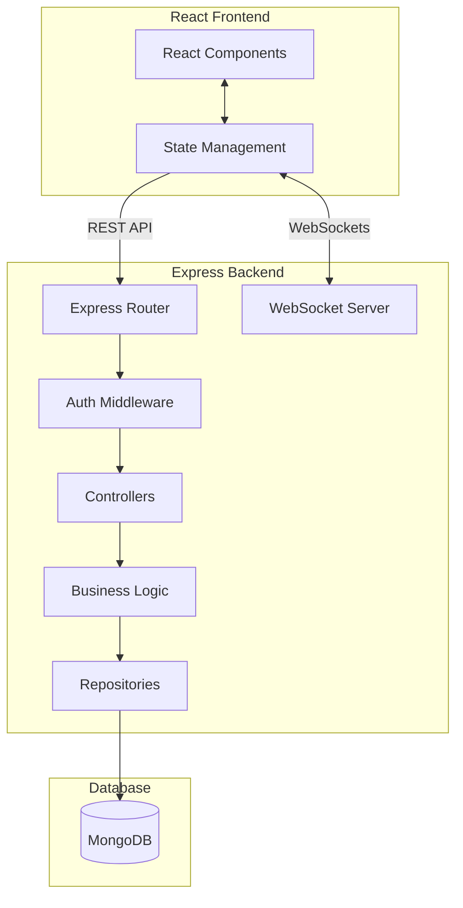

# Military Academy Management System (MessOps)

MessOps is a comprehensive, production-grade Military Mess Operations and Warehouse Management System designed to streamline inventory tracking, meal planning, and daily food distribution. By bridging the gap between back-end procurement and front-end consumption, the system provides an end-to-end operational platform for managing warehouse stocks, daily menus, meal reservations, and real-time distribution across military facilities.

## Overview

The platform is designed to govern two main operational domains securely and efficiently:
1. **Warehouse & Inventory**: Overseeing the complete lifecycle of goods, from initial supplier receiving to batch-level tracking, inter-warehouse transfers, stock counts, and waste management.
2. **Mess & Meal Management**: Facilitating the planning of menus, ingredient-based recipes, user meal reservations, and the final tracking of meal distribution and actual consumption.

## Key Features

### Authentication & Security
- **Authentication**: Secure login utilizing JSON Web Tokens (JWT) stored in HTTP-only cookies.
- **RBAC (Role-Based Access Control)**: Granular role and permission management system dictating access levels across all modules.
- **Protected Routes**: Enforced security on both Express API endpoints and React frontend routes.
- **Audit Logging**: Comprehensive, automatic tracking of critical system actions and data mutations.

### Warehouse & Inventory
- **Multi-Warehouse Management**: Distinct tracking of current stock across multiple storage facilities.
- **Catalog Management**: Structured management of Categories, Products, and measurement Units.
- **Supplier Management**: Registry of approved suppliers for procurement.
- **Batch Tracking**: Granular inventory control using batches, ensuring accurate expiration date and cost tracking.
- **Goods Receiving**: Workflows for intaking new stock from suppliers into specific batches.
- **Transfers & Returns**: Facilitating stock movement between warehouses and processing returns.
- **Stock Counts & Waste**: Modules for conducting physical inventory checks, reconciliations, and logging spoiled or damaged goods.
- **Inventory Transactions**: Immutable ledger of all movements affecting stock levels.

### Mess & Meal Management
- **Menus**: Planning daily meal offerings across varying meal times (breakfast, lunch, dinner).
- **Recipes**: Detailed formulation of meals, tying specific menu items to the exact inventory products (ingredients) required for preparation.

### Reservations & Distribution
- **Meal Requests & Reservations**: Systems for individuals or units to book attendance for upcoming meals.
- **Meal Distribution**: Real-time tracking interface to log actual attendance and food distribution during serving periods.

### Reporting & Dashboard
- **Interactive Dashboard**: A centralized, real-time overview displaying KPIs such as current inventory value, today's meal metrics, recent waste alerts, and distribution statistics.
- **Comprehensive Reports**: Dedicated analytics for:
  - Inventory and Batch status
  - Receiving and Transfers history
  - Waste tracking
  - Reservations vs. actual Meal Distributions
  - Overall stock Consumption

### Notifications
- **Real-Time Alerts**: Integrated WebSocket architecture providing instant notifications directly to the frontend client (via an interactive Notification Bell).

### Audit & Settings
- **Audit Logs**: Queryable interfaces to review the history of user actions and system changes.
- **System Settings**: Global configuration parameters adjustable by administrators.

## System Architecture

The application is built using a modern decoupled architecture, featuring a React/Vite frontend and a Node.js/Express backend communicating via RESTful APIs and WebSockets, backed by a MongoDB database.

## Technology Stack

### Frontend
- **Framework**: React 19 (via Vite)
- **Styling**: Tailwind CSS v4, Radix UI primitives, Lucide React
- **State Management**: Zustand, React Query (@tanstack/react-query)
- **Forms & Validation**: React Hook Form, Zod
- **Routing**: React Router DOM v7
- **Internationalization**: i18next

### Backend
- **Environment**: Node.js
- **Framework**: Express.js
- **Database**: MongoDB (via Mongoose)
- **Validation**: Joi
- **Security**: Helmet, bcrypt, JSON Web Tokens (JWT)
- **Real-time**: WebSockets (`ws`)

### Backend Architecture Pattern
The backend enforces a strict layered architecture to ensure separation of concerns:
`Controller → Service → Repository → Model`
- **Controllers**: Handle HTTP requests, responses, and routing.
- **Services**: Contain all core business logic and cross-domain operations.
- **Repositories**: The exclusive layer permitted to interact directly with Mongoose models.
